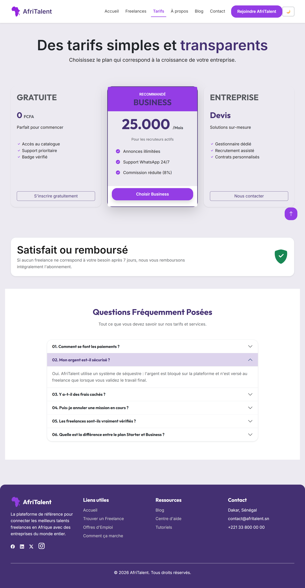
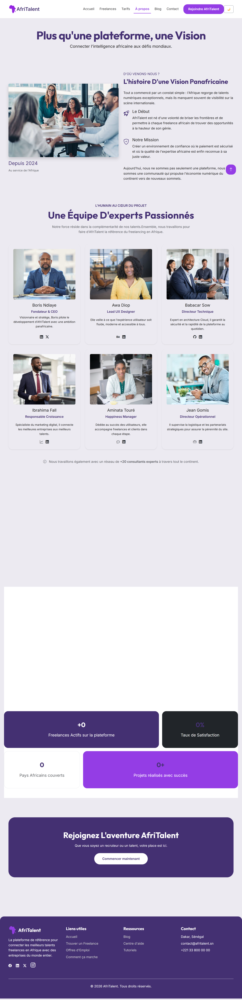
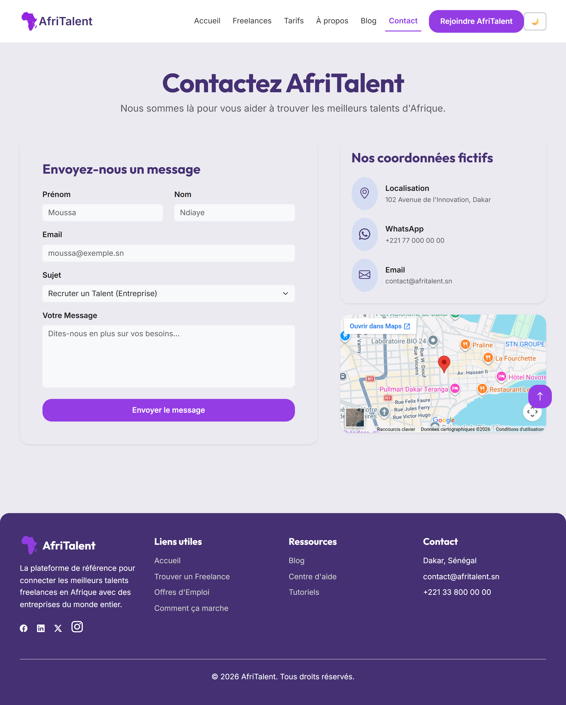
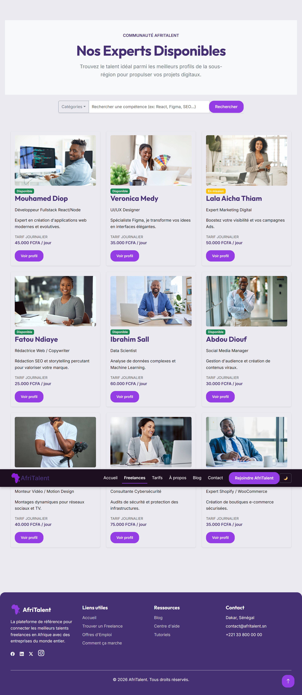

# AfriTalent 
Projet :— Plateforme de mise en relation entre freelances africains et clients. 
Auteur : Ndeye Sylla Tague  
Promotion : L1 DSBD — ISI 

## 📖 Description

« AfriTalent est le site vitrine d'une plateforme vitrine dédiée à la connexion entre les entreprises africaines et les freelances du secteur technologique. Le site invite les visiteurs à s'inscrire et met en avant les services, tarifs et profils de talents disponibles, tout en intégrant les standards du web 2026 : un design épuré en Bento Grid, une typographie soignée et une interactivité dynamique en JavaScript vanilla. »

## 🛠️ Technologies utilisées

- HTML5:                Structure sémantique (<header>, <nav>, <main>, <section>, <footer>)
- CSS3:                 Flexbox, CSS Grid, Bento Grid, animations, transitions, variables   CSSresponsive design
- Bootstrap 5:          Grille, navbar, cards, carousel, accordion, modal
- Bootstrap Icons:      Icônes
- Google Fonts:         Robot sans serif (titres) + Open Sans, sans-serif (corps)
- JavaScript Vanilla:   DOM, événements, IntersectionObserver, localStorage
- Git & GitHub:         Versioning, GitHub Pages

## ✨ Fonctionnalités principales

1.  Dark Mode / Light Mode   : toggle avec sauvegarde localStorage
2.  Compteurs animés         : s'incrémentent au scroll via IntersectionObserver
3.  Filtrage dynamique       : filtre les freelances par catégorie sans rechargement
4.  Validation de formulaire : regex email, messages d'erreur, retour visuel
5.  Navbar dynamique         : fond + ombre au scroll
6.  Bouton retour en haut    : smooth scroll
7.  Animations fade-in       : sections révélées au scroll

## 📁 Arborescence

Tague_NdeyeSylla_AfriTalent/
├── index.html          → Page d'accueil
├── freelances.html     → Catalogue de freelances
├── tarifs.html         → Plans et tarification
├── about.html          → À propos
├── contact.html        → Formulaire de contact
├── css/
│   └── style.css       → Styles CSS principaux
├── js/
│   └── main.js         → JavaScript vanilla
├── images/             → Images et logos
├── docs/
│   └── Tague_NdeyeSylla_Presentation.pptx
└── README.md
└── .gitignore

## 🚀 Lancer le projet en local

1. Cloner le dépôt :
bash
git clone https://github.com/Ndeye-Sylla-Tague/Tague-NdeyeSylla-Afritalent

2. Ouvrir le dossier dans VS Code
3. Lancer avec l'extension *Live Server* ou ouvrir index.html directement dans le navigateur

## 🌐 Site en ligne

👉  [https://ndeye-sylla-tague.github.io/Tague-NdeyeSylla-Afritalent/]

## 📸 Capture d'écran

## 📚 Ressources consultées

- [MDN Web Docs](https://developer.mozilla.org/fr/) — Référence HTML, CSS, JS
- [Bootstrap 5 Docs](https://getbootstrap.com/docs/5.3/) — Composants
- [Google Fonts](https://fonts.google.com/) — Polices
- [CSS-Tricks](https://css-tricks.com/) — Guides Grid & Flexbox
- [Awwwards](https://www.awwwards.com/) — Inspiration design